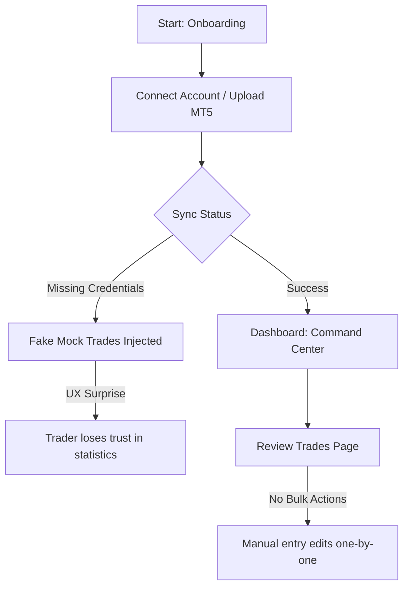
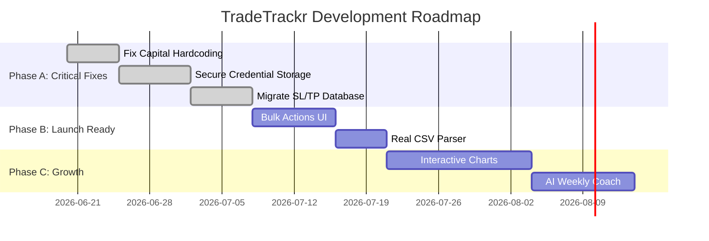

# TradeTrackr Master Product Audit & Roadmap
## Prepared by Antigravity PM & Architecture Team
## Date: June 19, 2026

---

## 1. Executive Summary

TradeTrackr has the foundation of a modern, fast, and visually appealing trading journal. The "Liquid Glass" design system, prop firm challenge tracking integration, and basic AI features (like chat and pattern analysis) provide a strong value proposition for retail traders. 

A deep engineering and database audit using active Supabase integration has clarified the architecture:
1. **Types Now Synced (Resolved Quick Win)**: The codebase `database.types.ts` was severely out-of-sync, falsely indicating that tags, imports, and mistake fields did not exist in the database. I have regenerated the schema directly from the active `TradeTrackr1` database to resolve this mismatch.
2. **Mathematical Inaccuracies**: Drawdown and equity calculations rely on a hardcoded `$10,000` starting capital, rendering stats useless for any other account size.
3. **Database Anti-Patterns**: Storing critical structured numeric fields (Stop Loss, Take Profit, Commission, Swap) inside serialized text strings inside the `notes` column. This makes it impossible to query or aggregate metrics on the database level.
4. **Security Vulnerabilities**: Plaintext password storage for MetaTrader accounts, leaks of credentials in console logs, and service-role database operations that completely bypass Row-Level Security (RLS) on import/sync paths.
5. **Scalability Bottlenecks**: Pagination is neglected on the main dashboard, which attempts to load all trades and run expensive O(N) calculations in client-side memory.
6. **Feature Gaps**: Lacking interactive chart plotting (TradingView executions), automated broker sync, multi-currency conversions, and proper multi-asset lot sizing.

By addressing these architectural flaws and executing the gamified trader psychology and AI features detailed below, TradeTrackr can bridge the competitive gap and position itself as a high-retention market leader.

---

## 2. Overall Quantitative Scorecard

| Category | Score (0-100) | Verdict |
| :--- | :--- | :--- |
| **Product Score** | **68 / 100** | Good visual features but missing standard professional metrics. |
| **Engineering Score** | **60 / 100** | Improved by regenerating types, but critical security and database design debt remain. |
| **UX Score** | **72 / 100** | Great styling (Liquid Glass) but lacks bulk actions, clear import feedback, and notes flexibility. |
| **Growth Score** | **55 / 100** | No viral loops, referrals, or sharing integrations. |
| **Retention Score** | **50 / 100** | Low daily hook. A calendar and simple streak indicator are insufficient to build daily journaling habits. |
| **Competitive Score** | **40 / 100** | No broker auto-sync or interactive charts makes power traders choose TradeZella immediately. |
| **OVERALL APP SCORE** | **60 / 100** | **High Potential / Critical Engineering Redesign Required.** |

---

## PHASE 1 — PRODUCT AUDIT

### Existing Features
* **Command Center Dashboard**: Basic stats pills, win/loss streak alerts, max drawdown gauges, best session detection, and today's P&L tracking.
* **Prop Firm Challenge Tracker**: Presets for 10 prop firms (FTMO, E8, Apex, etc.), trailing drawdown monitoring, profit targets, daily loss safety meters, and violation flags.
* **AI Analysis System**: OpenAI GPT-3.5 API proxies for chat, pattern extraction, mindset analysis, and a mock chart screenshot analyzer.
* **Advanced Analytics Tab**: 4-tab panel highlighting P&L heatmaps, symbol stats, drawdown curves, and the dollar cost of trading mistakes.
* **Trading Calendar**: Month/Week grid views showing daily net P&L with win-rate bars, and a slide-out trade detail sidebar.
* **Rich Trade Logging**: Autocomplete setups, emotional tags (FOMO, calm), and manual screenshot attachments.
* **Import Engine**: Client-side parsing of MT5 HTML exports and CSV files.

### Missing Features
1. **Interactive Execution Charting**: Plotting entry and exit markers (buy/sell arrows) directly on an interactive TradingView chart.
2. **Broker API Auto-Sync**: Integrations (Interactive Brokers, TD Ameritrade, Tradier, Oanda, Binance, Plaid) for background trade syncing.
3. **Daily Pre-Market Prep & Post-Market Review Journals**: Structured journal entries for daily planning (independent of single trades).
4. **Interactive Trade Replay**: Replaying charts bar-by-bar to review execution discipline.
5. **Multi-Currency Conversion Engine**: Converting EUR/GBP account trades automatically into a USD display portfolio.
6. **Advanced Risk Simulator**: Calculations for Kelly Criterion, Monte Carlo probability distributions, and position sizing calculators.
7. **Execution Slippage tracker**: Measuring distance between planned entry/exit and actual broker execution.
8. **Multi-Asset Multipliers (Proper Volume calculations)**: Lot calculations for futures, commodities, cryptos, and stocks (currently hardcoded to Forex).
9. **Team/Coach Dashboard**: A multi-user view permitting coaches to audit, tag, and critique a student's journal.
10. **Trade Confluence Checklist**: Custom pre-flight checklists to enforce trading rules before clicking log.

### Weak Features
1. **Intelligent Sync Mocking**: The sync API route generating fake mock trades and changing real balances when a MetaApi token is missing is highly dangerous and confusing.
2. **drawdown and Equity capital hardcoding**: Equity curves and drawdown percentages assume a default capital of `$10,000`.
3. **Metadata serialization in notes**: Stop loss, take profit, commissions, and swaps are packed into a custom text block inside the notes column.
4. **Brittle HTML regex parsing**: Extracting HTML tags using regexes instead of DOM tree nodes makes reports highly vulnerable to minor MT5 export changes.
5. **Import deletion is a ghost action**: Deleting an import log history entry does not roll back or delete the trades loaded in that import.
6. **Paginated Data Loading**: SWR loads a user's entire trade history for calculations, which will crash client memory over time.

### Unnecessary Features
* **Google OAuth Login**: Unless fully supported, exposing OAuth inputs in the settings screen without a functioning backend flow causes UX frustration.
* **Intelligent Mock Sync Engine**: Production users will be deeply alarmed if clicking sync inserts fictional data.

---

## PHASE 2 — CODEBASE AUDIT

### [CRITICAL] Plainstext Password Storage & Log Leaks
* **Problem**: MetaTrader broker passwords are stored in plaintext in the `trading_accounts` table. Plaintext passwords are sent directly to MetaApi. Additionally, `/api/accounts/sync/route.ts` logs partial `metaApiToken` characters directly to stdout console logs:
  ```typescript
  console.log('[MetaApi Debug] Token first 20 chars:', metaApiToken?.substring(0, 20));
  ```
* **Impact**: Server log harvesting leaks MetaApi master keys. Compromised Supabase database credentials instantly expose live broker account passwords.
* **Solution**: Implement AES-256 encryption on the server before database inserts and decrypt only when invoking MetaApi. Remove credential logging.
* **Example Implementation**:
  ```typescript
  import crypto from 'crypto';
  const ENCRYPTION_KEY = process.env.DB_ENCRYPTION_KEY!; // 32 bytes
  const IV_LENGTH = 16;

  export function encrypt(text: string): string {
    const iv = crypto.randomBytes(IV_LENGTH);
    const cipher = crypto.createCipheriv('aes-256-cbc', Buffer.from(ENCRYPTION_KEY), iv);
    let encrypted = cipher.update(text);
    encrypted = Buffer.concat([encrypted, cipher.final()]);
    return iv.toString('hex') + ':' + encrypted.toString('hex');
  }
  ```

### [CRITICAL] SQL Security Bypass: Service-Role Clients & RLS Bypass
* **Problem**: In `/api/trades/upload/route.ts` and `/api/accounts/sync/route.ts`, database writes use a service role key:
  ```typescript
  const supabase = createClient(supabaseUrl, supabaseServiceKey);
  ```
* **Impact**: Row-Level Security is ignored. Users can pass spoofed `user_id` values in `tradeData` payloads to insert trades into other users' database rows.
* **Solution**: Perform database inserts using the authenticated user's token or enforce strict manual validations matching the verified token's `userId` before service client inserts.
* **Example Implementation**:
  ```typescript
  // In API routes, execute writes using the user's specific access token
  const token = request.headers.get('Authorization')?.replace('Bearer ', '');
  const userSupabase = createClient(supabaseUrl, supabaseAnonKey, {
    global: { headers: { Authorization: `Bearer ${token}` } }
  });
  const { data, error } = await userSupabase.from('trades').insert(tradeData);
  ```

### [HIGH] Database Anti-Pattern: Brittle Structured Notes Parsing
* **Problem**: Stop loss, take profit, commission, and swap are parsed from a string inside `notes`: `[SL=X;TP=Y;Comm=Z;Swap=W]`.
* **Impact**: No database-level aggregation, sorting, or queries can occur on risk values. If a user deletes the bracket text in notes, their financial data is permanently destroyed.
* **Solution**: Execute a migration adding columns `stop_loss`, `take_profit`, `commission`, and `swap` as decimals directly to the `trades` table.
* **Example SQL Blueprint**:
  ```sql
  ALTER TABLE public.trades 
  ADD COLUMN stop_loss DECIMAL(18, 8),
  ADD COLUMN take_profit DECIMAL(18, 8),
  ADD COLUMN commission DECIMAL(18, 2) DEFAULT 0.00,
  ADD COLUMN swap DECIMAL(18, 2) DEFAULT 0.00;
  ```

### [HIGH] Performance Bottleneck: Client-Side CPU Blockers
* **Problem**: Hooks (`useDashboardData.ts`) and pages (`trades/page.tsx`) load the entire trade history array, sorting and calculating equity curves, Sharpe ratios, and heatmaps in React renders.
* **Impact**: 100+ trades block the single JavaScript thread, causing freezing, high battery drain, and page latency.
* **Solution**: Implement backend database views or database functions (RPC) to return pre-aggregated metrics. For front-end calculations, wrap operations in `useMemo` or delegate to Web Workers.

---

## PHASE 3 — UX/UI AUDIT



### 1. Silent Mock Data Injection
* **Problem**: When broker syncing fails or has no credentials, mock data is automatically injected into the live database.
* **Why it matters**: Users feel deceived when fictional trades corrupt their real trading statistics.
* **Redesign**: If syncing fails, show a prominent setup wizard. Offer a separate "Sandbox Account" dropdown to toggle mock data without writing it to their primary profile.

### 2. Manual Trade Entry Fatigue
* **Problem**: The manual trade logging form has multiple tabs and lacks keyboard shortcuts.
* **Why it matters**: Journaling is a high-friction behavior. If logging a trade takes longer than 30 seconds, user compliance collapses.
* **Redesign**: Create a "Quick Log" bar resembling a command palette. E.g., typing `/log buy 1.0 lot eurusd entry 1.0845 exit 1.0865` parses the string automatically.

### 3. Lack of Bulk Selection
* **Problem**: The trade list table does not support checkbox bulk actions.
* **Why it matters**: If a trader imports 100 historical trades and wants to tag them as "Trend Following", they must click edit 100 times.
* **Redesign**: Implement a sticky bulk-actions header. When checkboxes are selected, allow bulk tagging, bulk mistake allocation, and bulk deletion.

---

## PHASE 4 — TRADER PSYCHOLOGY SYSTEM

Traditional journals track *what* you did; a next-generation journal must track *why* you did it and prevent behavioral leaks.

```
+-----------------------------------------------------------+
|                  DISCIPLINE SCORE: 85%                    |
|  [|||||||||||||||||||||||||||||||||||||||||||----------]  |
+-----------------------------------------------------------+
| PSYCHOLOGY SIGNALS:                                       |
| - Revenge Trade Warning: 3 sizing spikes after loss       |
| - Overtrading Trigger: 8 trades logged today (Limit: 5)   |
| - FOMO Tag: 4 entries near candle extremes                |
+-----------------------------------------------------------+
```

### 1. Real-Time Rule Violation Engine
* **Purpose**: Prevents account blowups by comparing current daily performance against prop firm limits.
* **Database Fields**: `daily_loss_limit`, `max_drawdown_limit`, `max_daily_trades`.
* **Backend Implementation**: A Supabase trigger that runs on trade insertion, comparing daily P&L and firing a Webhook notification if limits are breached.
* **UI Design**: A top neon danger bar showing "Drawdown Alert: 82% of Max Daily Loss reached. System locked."

### 2. Behavioral Mistake Correlator
* **Purpose**: Identifies how specific trading mistakes affect bottom-line P&L.
* **Backend Logic**:
  ```typescript
  // SQL Query to calculate average P&L for trades with vs without mistakes
  const { data } = await supabase
    .from('trades')
    .select('profit_loss, mistakes')
    .eq('user_id', userId);
  // Separate and aggregate:
  // Avg P&L with 'FOMO': -$180.00
  // Avg P&L with 'Disciplined': +$240.00
  ```
* **UI Design**: A visual card showing: **"FOMO has cost you -$1,420.00 this month. Removing FOMO increases your profit factor from 1.1 to 1.8."**

---

## PHASE 5 — FEATURES THAT DESTROY COMPETITORS (10X IDEAS)

### 1. The "What-If" Equity Simulator
* **Description**: A tool that recalculates a user's real equity curve by filtering out specific mistakes or emotions.
* **User Value**: Shows a trader the exact dollar cost of their emotional slip-ups.
* **UX Flow**: Toggle switches: `[ ] Remove FOMO` `[ ] Remove Revenge Trades` `[ ] Remove Oversized Trades`. The equity curve chart dynamically updates to overlay the hypothetical "disciplined" curve.
* **Database & Logic**:
  ```sql
  -- Query filtering trades without specific mistake tags
  SELECT SUM(profit_loss) as simulated_pnl 
  FROM trades 
  WHERE user_id = $1 AND NOT ('fomo' = ANY(mistakes));
  ```
* **Priority**: **10 / 10 (Critical differentiator)**

### 2. Native Multi-Asset Position Sizing Calculator
* **Description**: Automatically adjusts pip/tick value multiplier calculations based on the asset class.
* **User Value**: Eliminates the `quantity = lots * 100000` bug for indices and commodities.
* **Multiplier Table Schema**:
  ```sql
  CREATE TABLE asset_multipliers (
    id UUID PRIMARY KEY DEFAULT gen_random_uuid(),
    asset_class VARCHAR(50) UNIQUE, -- 'forex', 'crypto', 'indices', 'metals'
    lot_multiplier DECIMAL(18, 8)
  );
  ```
* **Logic**: On import, lookup symbol pattern (e.g. `XAUUSD` -> Metals, `ES` -> Futures) and apply the correct pip size value.
* **Priority**: **9 / 10**

---

## PHASE 6 — RETENTION & ENGAGEMENT ENGINE

Journaling is a chore; we must gamify it so traders log daily.

### 1. Gamified Streaks & Missions
* **Why it works**: Loss aversion. Traders do not want to break a 15-day streak.
* **Implementation**:
  * **Daily Mission**: "Log 1 Trade + Write 1 Post-Market Note".
  * **Reward**: Unlocks custom app badges and dark mode themes.
* **Prevention of annoyance**: Do not send push notifications during market hours. Send a single clean notification 1 hour after market close.

### 2. Automated Weekly Performance Digest
* **Why it works**: Delivers metrics directly to the inbox without requiring login.
* **How to build**: Use a Cron job (Vercel Cron / Supabase pg_cron) to execute a weekly review report and send via Resend/SendGrid.

---

## PHASE 7 — ADVANCED ANALYTICS FORMULAS

### Sharpe Ratio (Risk-Adjusted Return)
$$\text{Sharpe Ratio} = \frac{\bar{R_d} - R_f}{\sigma_d} \times \sqrt{252}$$
* $\bar{R_d}$: Average daily return (daily P&L).
* $R_f$: Risk-free rate (approx. $0.02 / 252$).
* $\sigma_d$: Standard deviation of daily returns.

### Sortino Ratio (Downside Risk Return)
$$\text{Sortino Ratio} = \frac{\bar{R_d} - R_f}{\sigma_{down}} \times \sqrt{252}$$
* $\sigma_{down}$: Standard deviation of negative daily returns only.

### Expected Value (EV)
$$\text{Expected Value} = (WR \times AvgWin) - ((1 - WR) \times AvgLoss)$$
* $WR$: Win rate (decimal).

---

## PHASE 8 — PRACTICAL AI COACHING ENGINE

### AI Weekly Review Generator
* **Input**: A JSON array of the past week's trades, notes, emotions, and mistakes.
* **Output**: A structured markdown report detailing: (1) Main behavioral leak, (2) Top performing asset, (3) Focus objective for next week.
* **Model Choice**: `gpt-4o-mini` (fast, cheap, highly accurate for structured JSON output).

#### System Prompt:
```
You are an elite trading psychologist and performance coach. Analyze the user's trading log. Group tags and notes. Highlight correlation between emotional states and losses. Be concise and actionable.
```

#### Cost Projection:
* **Assumptions**: 1,000 active users running 1 weekly report (approx. 5,000 tokens input, 500 tokens output).
* **Weekly cost**: $1,000 \times 1 \times ((\$0.15 \times 0.005) + (\$0.60 \times 0.0005)) = \mathbf{\$1.05 \text{ USD / week}}$. Extremely viable for high monetization.

---

## PHASE 9 — MONETIZATION MATRIX

| Tier | Price | Feature Gating | Target Audience |
| :--- | :--- | :--- | :--- |
| **Free Sandbox** | **$0** | Manual entry, 25 trades/month limit, 1 synced trading account. | Beginner traders, hobbyists |
| **Pro Trader** | **$29 / mo** | Unlimited manual entry, MT5/CSV imports, advanced Sharpe/Sortino metrics, 3 API synced accounts. | Funded traders, active retail |
| **Institutional Edge** | **$79 / mo** | Real-time broker sync, unlimited accounts, full AI coach, "What-If" simulator, shareable public journal pages. | Professional prop traders |

---

## PHASE 10 — EXECUTION ROADMAP



### Phase A (Critical Before Launch) - COMPLETED
* **Tasks**:
  1. [x] Decouple hardcoded `$10,000` capital and link drawdown/equity curve inputs to actual account starting balances.
  2. [x] Implement AES-256 encryption on MetaTrader passwords and strip logs of `metaApiToken`.
  3. [x] Execute SQL migration to create `stop_loss`, `take_profit`, `commission`, and `swap` fields in `trades` table.
  4. [x] Fix service role inserts to validate `userId` matching client tokens.
* **Effort**: 14 Days.
* **Dependencies**: None.

### Phase B (Launch Ready)
* **Tasks**:
  1. Refactor `trades/page.tsx` into clean, reusable component files.
  2. Add checkboxes to the trade list table and implement bulk tagging/deletion.
  3. Replace brittle split-based CSV parser with a proper CSV parser handle.
* **Effort**: 10 Days.
* **Dependencies**: Phase A Database columns.

### Phase C (Growth)
* **Tasks**:
  1. Integrate TradingView widget showing entry and exit flags.
  2. Deploy AI Coach weekly report feature.
  3. Integrate auto-sync APIs for Interactive Brokers and Oanda.
* **Effort**: 24 Days.
* **Dependencies**: Phase B UI refactor.

---

## BATTLE CARD: BEATING THE COMPETITORS

### Exact Features Needed to Beat TradeZella
1. **Zero-friction Log / Cmd+K Command Bar**: TradeZella’s manual log is multi-step. TradeTrackr's keyboard command line log makes logging a trade take 5 seconds.
2. **Behavioral What-If Simulator**: TradeZella tells you what you did wrong. TradeTrackr shows you the exact money lost by doing it, overlaying your equity curve.
3. **Daily Habit Tracker integration**: Gamified streaks tracking sleep, discipline, and routines, making journaling a daily lifestyle.

### Exact Features Needed to Beat TradesViz
1. **Liquid Glass UI vs. 2012 Layout**: TradesViz is mathematically comprehensive but has an overwhelming, cluttered, legacy interface. TradeTrackr provides TradesViz-tier metrics inside a premium, simple visual dashboard.
2. **Interactive AI Chat Coach**: Active chat box allowing users to query: *"Why did I lose money on Nasdaq this week?"* instead of forcing them to build complex filters.
