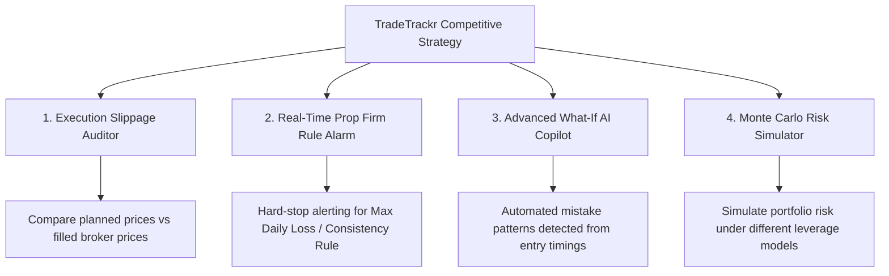

# TradeTrackr: Refactoring, Performance & Competitive Roadmap

This document provides a realistic evaluation of the current state of TradeTrackr, analyzes how to win against dominant competitors like TradeZella, and organizes future improvements into clear, actionable phases.

---

## 1. Competitive Strategic Assessment (How to Win Against TradeZella)
Competing head-to-head with TradeZella, Journalytix, or Trademetria on basic logging and chart overlays will lead to high user acquisition costs and churn. To win, TradeTrackr must focus on **unique, high-utility features** that retail, funded, and prop-firm traders cannot find elsewhere:

### The 4 Killer Features to Build
1. **The Broker Slippage Auditor**:
   * *The Problem*: Funded traders and prop-firm participants frequently suffer from terrible execution fills (slippage) due to broker markup and latency.
   * *Our Advantage*: Let users log their target entry/exit prices. TradeTrackr will calculate the exact dollar cost of slippage per broker. This data can guide traders to select better brokers or prop firms, creating a high-viral-coefficient feature.
2. **Real-Time Prop Firm Target & RLS Rule Alarm**:
   * *The Problem*: Over 90% of traders fail prop-firm challenges (e.g., FTMO, FundedNext) by violating rules like Max Daily Loss or the Consistency Rule.
   * *Our Advantage*: A live compliance engine checking rules in real-time, sending instant alerts (webhooks to Discord or Telegram) when a trader is within 1% of a violation.
3. **Automated AI Trade Copilot (Full Account Context)**:
   * *The Problem*: General journal chat interfaces only look at single trades.
   * *Our Advantage*: A chat interface with global account context. Users can ask: *"What was my worst strategy on XAUUSD this week, and how many times did I violate my rules?"* 
4. **Position Sizing & Monte Carlo Risk Simulator**:
   * *The Problem*: Retail traders struggle with leverage and blow their accounts.
   * *Our Advantage*: Built-in Kelly Criterion calculators and Monte Carlo probability distribution graphs that show the mathematical likelihood of account ruin.

---

## 2. Technical Audit: Discovered Performance Gaps & Refactoring Needs
Although critical items (like DOM HTML table parsing and async syncing) have been resolved, several real gaps remain:

### Performance & Security Gaps
* **Incognito/Private Mode Crash Risk** (`src/lib/utils.ts`):
  * *Issue*: Resolving screenshot URLs relies on scraping Supabase tokens from `localStorage`. In private tabs or incognito mode where storage access is blocked, this triggers auth exceptions.
  * *Fix*: Retrieve tokens dynamically from the active Supabase client session state using `supabase.auth.getSession()`.
* **Database Query Direct Coupling**:
  * *Issue*: Front-end components directly call the Supabase client. If table schemas change or security rules are modified, developers must refactor SQL queries in dozens of different code files.
  * *Fix*: Fully migrate all queries to utilize the service layer in `src/lib/services/tradeService.ts`.
* **State Syncing Waterfalls**:
  * *Issue*: Switching pages triggers rapid context updates, causing dashboard widgets to reload.
  * *Fix*: Standardize SWR deduplication times and share cached values across providers.

---

## 3. Phased Roadmap (Refactoring & Feature Implementation)

### Phase 1: Security & API Robustness (Technical Debt)
* **1.1 Safe Auth Token Parsing**:
  * Refactor `resolveTradingViewUrl` inside `src/lib/utils.ts` to fetch the auth token cleanly from the Supabase session, adding a fallback for incognito environments.
* **1.2 Clean Inactive Mock Code**:
  * Remove commented code blocks, stale templates, and dead reference structures inside `/api/accounts/sync` routes to decrease cognitive overhead.
* **1.3 RLS Validation Tests**:
  * Set up database connection pool tests to ensure multi-tenant security is strictly enforced under high concurrency.

### Phase 2: High-Value Core Features (Trade Detail Upgrades)
* **2.1 TradingView Execution Charting**:
  * Integrate the `lightweight-charts` package into [TradingViewChart.tsx](file:///c:/Users/PC/Desktop/finaltry/src/components/trades/TradingViewChart.tsx) inside the details drawer.
  * Plot exact execution marks (green up-arrows for buys, red down-arrows for sells) on the price candlesticks.
* **2.2 Bulk Operations Rate Limiting**:
  * Integrate the `checkClientRateLimit` routine into bulk delete and CSV import actions to protect PostgreSQL connection limits.

### Phase 3: The Competitive Edge (Compliance & Risk Systems)
* **3.1 Prop Firm Challenge Target Tracker**:
  * Build a dedicated tab dashboard inside `PropFirmAnalyticsTab` that measures target goals (e.g. Consistency rules, Max Daily Drawdown, Daily loss buffer limit).
* **3.2 Monte Carlo Account Ruin Simulator**:
  * Develop the probability distribution chart showing risk curves and Kelly Criterion position recommendations.
* **3.3 Execution Slippage Log**:
  * Add `target_entry_price` and `target_exit_price` fields to the trade forms.
  * Add a slippage metric card displaying avg. points lost per asset.

### Phase 4: AI & Gamification (Trader Retention)
* **4.1 Global Context AI Assistant**:
  * Feed user statistics summaries directly into the OpenAI/Claude system prompt to answer complex audit questions.
* **4.2 Daily Streaks & Milestones**:
  * Track journal consistency streaks, trigger confetti animations on dashboard updates, and reward profile badges.
