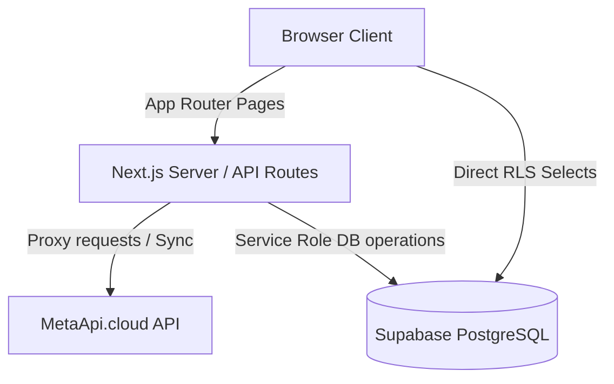

# Project Analysis — TradeTrackr

## 1. Project Overview
TradeTrackr is a modern, high-performance, and visually premium trading journal and analytics dashboard designed for retail and funded traders (prop firm challenge participants). It helps traders log trades manually or sync via API, track emotional states and journaling streaks, measure prop firm target compliance, and review performance with AI-powered suggestions.

---

## 2. Technology Stack
* **Frontend Core**: Next.js 14.2.30 (App Router), React 18.2.0, TypeScript 5.3.3
* **Styling & Theming**: Tailwind CSS 3.4.1, Vanilla CSS (`src/app/globals.css`), Next-Themes 0.4.6
* **Data Caching & Synchronization**: SWR 2.3.3 (stale-while-revalidate client caching)
* **Visualizations & Charts**: Recharts 2.11.0, Chart.js 4.5.1, React-ChartJS-2 5.3.1, Tremor React 3.13.1
* **Backend Database & Storage**: Supabase PostgreSQL 17.6, `@supabase/supabase-js` 2.39.3, `@supabase/auth-helpers-nextjs` 0.10.0
* **API Clients**: Axios 1.6.7
* **Utilities**: date-fns 3.3.1, framer-motion 11.0.3, uuid 11.1.0, downshift 9.0.9

---

## 3. Architecture Explanation
TradeTrackr utilizes Next.js App Router for server-rendered page frameworks combined with client-side state.



* **Client-First Fetching with Cache**: The application queries Supabase directly from client hooks (`useTrades`, `useDashboardData`) using standard Row Level Security (RLS) policies. It wraps these fetches in SWR to cache data and avoid redundant network request waterfalls on page transitions.
* **Server Proxies for Secrets**: Operations requiring third-party API keys or encryption/decryption keys (such as MetaApi synchronization, economic calendar feeds, and media signed URLs) are proxied through server-side Next.js route handlers (`/api/accounts/sync`, `/api/calendar`, `/api/media`) to prevent leaking API keys or decryption tokens in client-side bundles.
* **Database Triggers**: Key workflows, such as user profile creation on auth registration and user_id association, are driven directly by database triggers (`handle_new_user()`, `set_user_id_on_trades()`).

---

## 4. Folder Explanation
```
src/
├── app/               # Next.js App Router folders, page entries, and API routes
│   ├── accounts/      # Trading accounts management page
│   ├── analytics/     # Detailed analytics dashboard tab views (Worker-backed)
│   ├── api/           # API routes (sync, upload, media, calendar, cron, etc.)
│   ├── calendar/      # Trading calendar view
│   ├── dashboard/     # Core dashboard widgets and performance gauges
│   ├── playbook/      # Playbook/Strategy rules management
│   ├── profile/       # User profile details
│   ├── settings/      # General preferences and starting balance settings
│   └── welcome/       # Onboarding questionnaire and checklist
├── components/        # Reusable visual subcomponents
│   ├── ui/            # Basic layout elements (Buttons, Skeletons, EmptyState)
│   ├── layout/        # Shared components (Header, CommandPalette, Switcher)
│   └── trades/        # Complex trades table, filter panel, and details drawer
├── hooks/             # Custom SWR and auth hooks (useTrades, useStreak)
├── lib/               # Shared logic, calculations, and Supabase client
├── providers/         # Global context providers (Theme, Settings, Accounts)
└── types/             # Shared TypeScript structures and API request models
```

---

## 5. Data Flow
### Trade Creation and Image Upload
1. Trader logs a trade manually in `EnhancedTradeForm` or imports a CSV.
2. The trade gets validated client-side and saved to Supabase (utilizing RLS bound policies).
3. If a screenshot is uploaded:
   - Client uploads it to the `trade-screenshots` bucket namespaced by user ID.
   - The screenshot URL path is saved in the trade record.
   - Images are loaded through `/api/media?url=...` which creates a temporary signed URL, ensuring screenshots remain private.

### MetaApi Synchronizer
1. User clicks "Sync" on the account switcher.
2. Request goes to POST `/api/accounts/sync` proxy.
3. The server decrypts the broker password and checks MetaApi's provisioning system to ensure the MT5 cloud instance is deployed.
4. Historical deals are fetched, filtered for duplicates, and batch-inserted into the database.
5. Account balances are updated in the background.

---

## 6. Strengths
* **Highly Premium Aesthetics**: Fluid neon glows, dark mode accents, responsive layout transitions, and clean typography.
* **Optimized Calculations**: Heavy charting computations on the Analytics tab are offloaded to a Web Worker (`analytics.worker.ts`), preventing UI frame drop jank.
* **Caching Efficiency**: SWR prevents rendering thrash and API request spam by sharing query states globally.
* **Strict Security Boundaries**: Relies on owner-bound PostgreSQL RLS policies to prevent Cross-Tenant data access.

---

## 7. Weaknesses
* **Unimplemented Video Review**: Although `/api/trades/upload` supports trade recording video uploads, the UI has no component or player to review them.
* **MetaApi Dependency**: Broker synchronization requires active MetaApi cloud accounts, which can experience deployment timeouts (up to 15 attempts checked in loop).
* **High Reliance on Client Caching**: Settings and accounts states are highly dependent on Client-side context. If contexts are incorrectly configured, page components re-mount and re-trigger fetches.
* **Lack of Multi-Currency Support**: Trade statistics and P&L assume a single currency (typically USD), which can confuse international traders logging EUR or GBP accounts.
